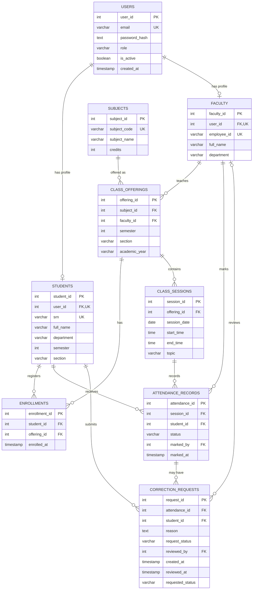

# ER diagram — College Attendance Management System

```mermaid
erDiagram
    USERS ||--o| STUDENTS : "has profile"
    USERS ||--o| FACULTY : "has profile"
    SUBJECTS ||--o{ CLASS_OFFERINGS : "offered as"
    FACULTY ||--o{ CLASS_OFFERINGS : "teaches"
    STUDENTS ||--o{ ENROLLMENTS : "registers"
    CLASS_OFFERINGS ||--o{ ENROLLMENTS : "has"
    CLASS_OFFERINGS ||--o{ CLASS_SESSIONS : "contains"
    CLASS_SESSIONS ||--o{ ATTENDANCE_RECORDS : "records"
    STUDENTS ||--o{ ATTENDANCE_RECORDS : "receives"
    FACULTY ||--o{ ATTENDANCE_RECORDS : "marks"
    ATTENDANCE_RECORDS ||--o{ CORRECTION_REQUESTS : "may have"
    STUDENTS ||--o{ CORRECTION_REQUESTS : "submits"
    FACULTY o|--o{ CORRECTION_REQUESTS : "reviews"

    USERS {
      int user_id PK
      varchar email UK
      text password_hash
      varchar role
      boolean is_active
      timestamp created_at
    }
    STUDENTS {
      int student_id PK
      int user_id FK,UK
      varchar srn UK
      varchar full_name
      varchar department
      int semester
      varchar section
    }
    FACULTY {
      int faculty_id PK
      int user_id FK,UK
      varchar employee_id UK
      varchar full_name
      varchar department
    }
    SUBJECTS {
      int subject_id PK
      varchar subject_code UK
      varchar subject_name
      int credits
    }
    CLASS_OFFERINGS {
      int offering_id PK
      int subject_id FK
      int faculty_id FK
      int semester
      varchar section
      varchar academic_year
    }
    ENROLLMENTS {
      int enrollment_id PK
      int student_id FK
      int offering_id FK
      timestamp enrolled_at
    }
    CLASS_SESSIONS {
      int session_id PK
      int offering_id FK
      date session_date
      time start_time
      time end_time
      varchar topic
    }
    ATTENDANCE_RECORDS {
      int attendance_id PK
      int session_id FK
      int student_id FK
      varchar status
      int marked_by FK
      timestamp marked_at
    }
    CORRECTION_REQUESTS {
      int request_id PK
      int attendance_id FK
      int student_id FK
      text reason
      varchar request_status
      int reviewed_by FK
      timestamp created_at
      timestamp reviewed_at
      varchar requested_status
    }
```
